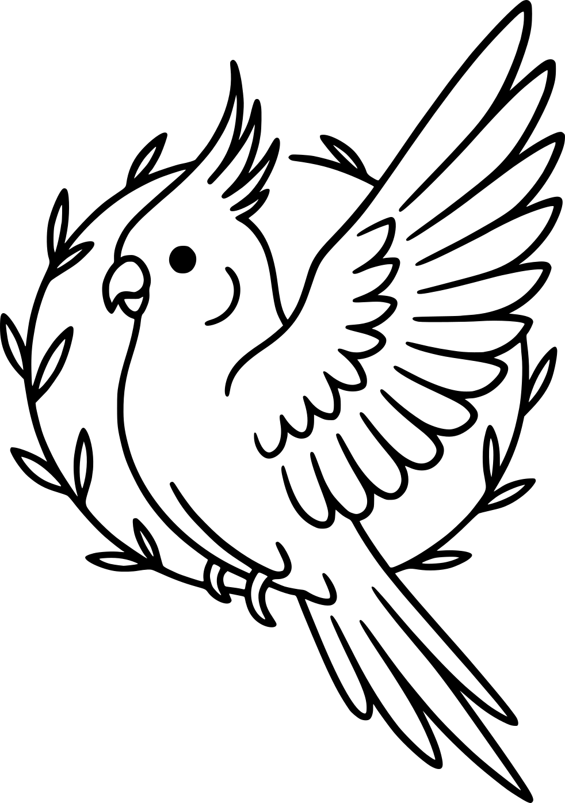
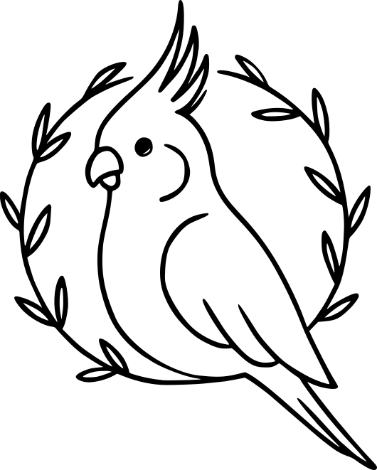

    
    

$$
\Large{\mathcal{W}elcome \; \mathcal{T}o \; \mathcal{M}y \; \mathcal{G}arden}
$$
My name is Ömer Kurt, and welcome to my digital garden. In this garden, I will share my thoughts, notes, and inner world. My digital garden will be a space that is constantly evolving and growing. Each article, each thought will be a part of this garden. When I think about a topic, learn something new, or am inspired by an experience in life, I will add another seed to this garden.

This space is not just about sharing information; it will also be a reflection of an inner journey. Together we will explore the meaning of life, where technology is going, the power of games and stories, the complexity of the digital world, and so much more.

In this garden, nothing will remain in its final form; thoughts will grow, change, sprout, and transform. I am opening a door to my own thoughts, notes, and inner world, and perhaps there will be much to discover with you on this journey.

I hope you enjoy taking the first steps in my digital garden.

For you to navigate comfortably in this garden:

-   [Notes](Notes/), where I present what I have learnt in more detail, can be found here.
-   [Life](Life/), where I chronicle my journeys, adventures, camping escapades, along with the books that have inspired me and the games that have captivated me.
-   [Mindspace](Mindspace), where I share my reflections, ideas, and personal insights about various topics that intrigue or challenge me.

## Contact
-   Github: omerkurtdev

-   Email: omer[at]omerkurt.dev